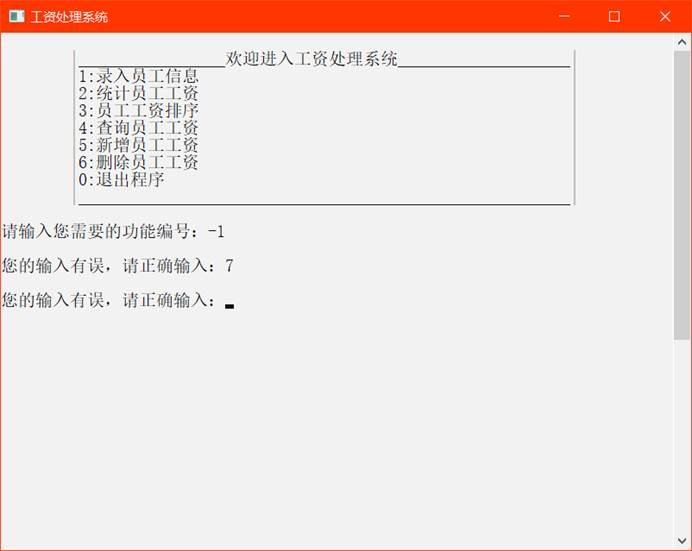

工资处理系统实验说明书

---

一、需求描述

1、首选出现欢迎界面（改标题，改窗口背景色，改窗口大小）。按任意键继续。

2、清屏。登录界面。

  用户名：admin

   密码：chixin12345 （*）

  判断用户名和密码是否正确？有三次机会。---》程序结束。

​                     ---》进入下一界面。

3、清屏。功能选择页面

​    1----录入员工信息

​    2----统计员工工资

3----员工工资排序

4----查询员工工资

5----新增员工工资

6----删除员工工资

​    0----退出程序

4、详细功能参照：

（1）录入员工信息：

编写函数：

input_data(char uid[3], int salary, int csalary, int revenue, int _water_electricity, int _deductions)，作用为输入职工的代号，岗位工资，薪级工资，其他补贴，水电费，其他扣款。

其中，uid: 职工代号。salary: 岗位工资。csalary: 薪级工资。revenue: 其他补贴。

_water_electricity: 水电费。_deductions: 其他扣款。

******函数也可以通过结构体实现，函数格式可自行修改。*

（2）统计员工工资：

编写函数：

calculate(char uid[3], int salary, int csalary, int revenue, int _water_electricity, int _deductions, int t_salary, int deduction_count, int r_salary)，计算应发工资，扣款合计，实发工资。数据存储均为数组，数组大小可自行定义。

******函数也可以通过结构体实现，函数格式可自行修改。*

其中，uid: 职工代号。salary: 岗位工资。csalary: 薪级工资。revenue: 其他补贴。

_water_electricity: 水电费。_deductions: 其他扣款。t_salary: 应发工资。deduction_count: 扣款合计。r_salary: 实发工资。

（3）员工工资排序：

编写函数sort(……)，针对设定的结构进行员工工资升序排序。

******函数也可以通过结构体实现，函数格式可自行修改。*

（4）查询员工工资：

编写函数search(char uid[][5])，根据员工代号进行查询，并输出当前查找的员工工资。******函数也可以通过结构体实现，函数格式可自行修改。*

 

（5）新增员工工资：

编写函数add(……)，可通过该项功能进行信息的添加。

******函数也可以通过结构体实现，函数格式可自行修改。*

（6）删除员工工资：

编写函数delete(……)，可通过该项功能将某代号员工的信息删除。

******函数也可以通过结构体实现，函数格式可自行修改。*

 

二、整体设计

三、模块设计

欢迎：void welcome(){  

​      打印欢迎进入工资处理系统

​               制作者:203班16号迟鑫

​             按任意键进入主菜单

}

登录：void login(){

​      创建账户名及密码，如密码不匹配，则需重新输入。

​           验证账户名及密码，密码允许3次验证，超过3次，程序结束运行。

} 

主菜单：void menu(){

​     

​    |_________________欢迎进入工资处理系统__________________|

​    |1:录入员工信息                      |

​    |2:统计员工工资                      |

​    |3:员工工资排序                      |

​    |4:查询员工工资                      |

​    |5:新增员工工资                      |

​    |6:删除员工工资                      |

​    |0:退出程序                        |

​    |_________________________________________________________|

  需要按照提示正确输入，否则会提示您的输入有误，请正确输入：，键盘输入相应选项进入相应功能。

}

录入员工信息：void input_data(){

​    主菜单按1加回车进入功能区。

  请输入需要录入的员工人数：,再依次输入员工信息，数据之间以空格间隔，各员工之间以回车间隔。

  程序自动提示当前录入的员工序号。

  全部录入成功后系统提示全部信息录入完成

请按任意键继续回到主菜单继续操作。

}

统计员工工资：void calculate (){

  主菜单按2加回车进入功能区，屏幕打印出系统录入的员工信息，按任意键回到主菜单。

}

员工工资排序：void sort(){

  主菜单按3加回车进入功能区，屏幕打印出按照员工实发工资升序排列的员工工资信息，按任意键回到主菜单。

}

查询员工工资：void search (){

  主菜单按4加回车进入功能区，系统提示请输入员工代号：，输入完毕后回车，屏幕打印出查找到的员工的工资信息，按任意键返回到主菜单。

}

新增员工工资：void add (){

  主菜单按5加回车进入功能区，系统提示请输入新增人数：，系统会自动提示当前输入的员工序号，输入完毕后回车，提示新增人员成功，按任意键返回到主菜单。

}

删除员工工资：void delete (){

  主菜单按6加回车进入功能区，系统提示请输入要删除的员工代号：输入完毕后回车，提示员工删除成功，按任意键返回到主菜单。

}

退出程序：主菜单按0加任意键，结束程序。

四、运行结果

​                     

